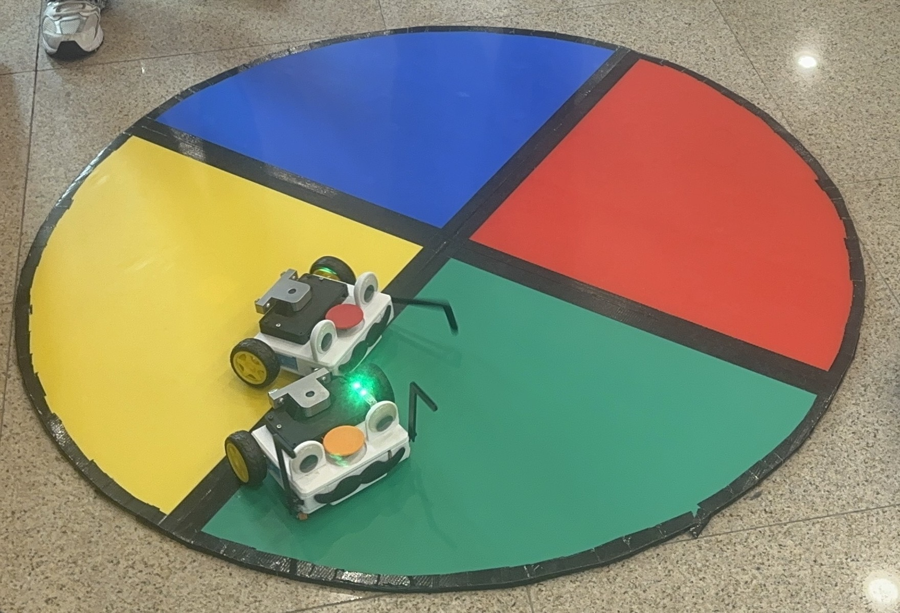

# Sumo Robots for Outreach – NP SOE MR Course

## 📷 Media

### Robot Photos & Demo

<video src="images/IMG_1524.mp4" width="50%" autoplay loop muted playsinline>
</video>

Check out the robots in action here:  
👉 [Instagram Reel](https://www.instagram.com/reel/DOiXAfOkolM/)

## 📖 Project Concept
This project combines the excitement of **traditional sumo bots** with the competitive elements of **battle bots**, creating a simple, fun, and entertaining outreach game.  
Designed for the NP School of Engineering (SOE) MR course, these robots are used to engage students and showcase robotics in an interactive way.

---

## ⚙️ How It Works
- **Power**: Each robot is powered by a **12V 50A lithium-ion battery**.  
- **Control System**:  
  - **ESP32 (38-pin)** as the main microcontroller.  
  - **GPIO ESP32 DevKit + MotorShield (Khurs Labs design)** for extended connectivity and for motor, servo, and LED control..  
- **Inputs**: Robots are operated via a **Bluetooth controller** and physical **button inputs**.  

---

## 🎮 Game Objective
Two robots face off in the playfield with **two possible win conditions**:
1. **Push the opponent out** of the playfield.  
2. **Disable the opponent’s robot** by pressing its button **three times**.  

---

## 🛠️ Bill of Materials (BOM)
The full Bill of Materials used for the construction of the robots can be found here:  
👉 [BOM Spreadsheet](https://docs.google.com/spreadsheets/d/12DGVmHnmU5uExtWquhwOgIkC1AQ5d1AGcQBVyyvAe2k/edit?gid=607887248#gid=607887248)

---

## 🚀 Features
- Hobby motors with stable battery supply.  
- ESP32-based control for wireless communication and smooth performance.  
- Specialised motor shield for integrated motor, servo, and LED management.  
- Interactive and entertaining gameplay mechanics.  

